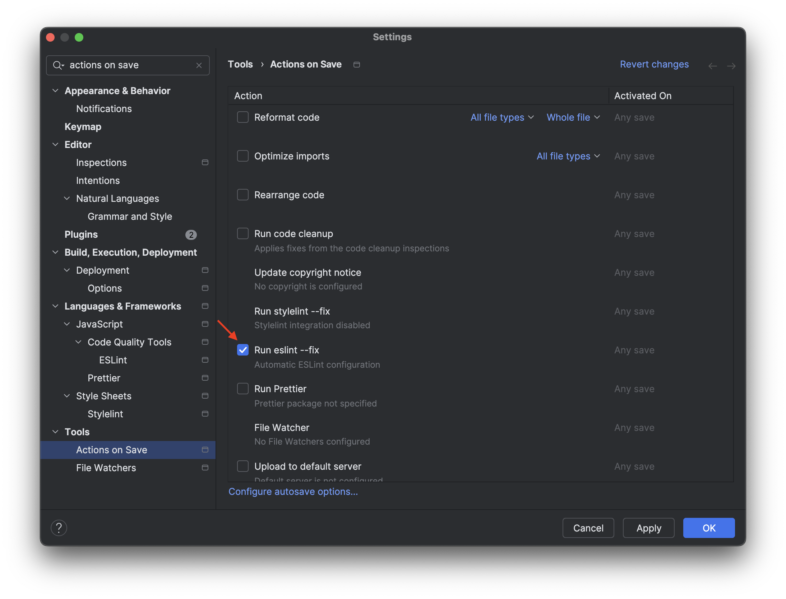
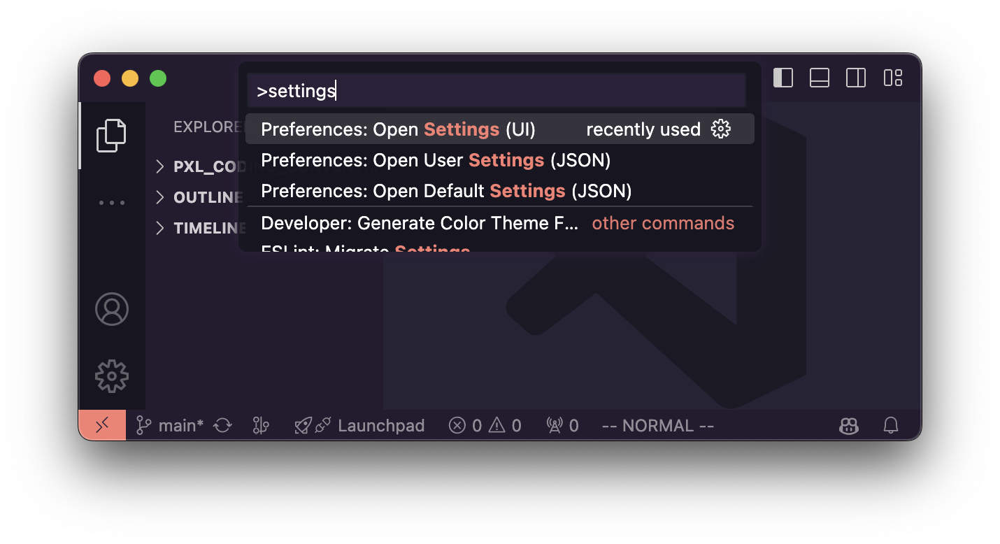
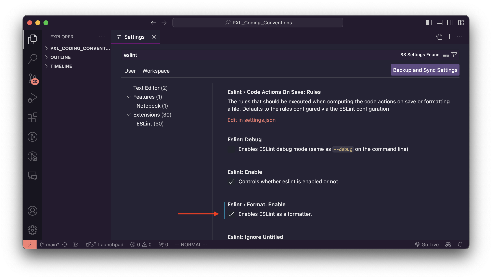
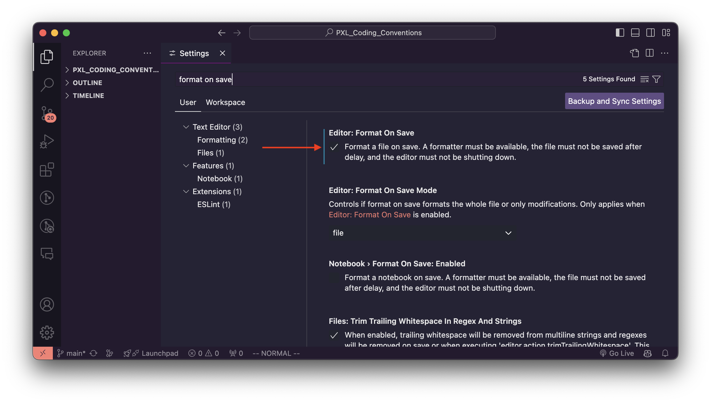
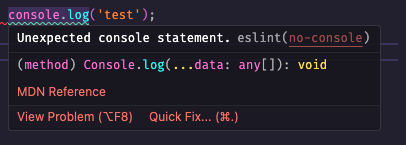

# JavaScript

## Configuratie IDE

We gebruiken [ESLint](https://eslint.org/) om de code te controleren op fouten en om de code te formatteren. De configuratie van ESLint is gebaseerd op de [Code Conventions](./javascript_conventions.md).

### ESLint-configuratie

Indien je nog geen NPM-project hebt, maak dan een nieuw project aan.

```sh
npm init -y
```

Installeer ESLint met de Airbnb Style Guide-regels.

```sh
npx install-peerdeps --dev eslint-config-airbnb-base
```

Dit zal de volgende packages installeren:

- `eslint`
- `eslint-config-airbnb-base`
- `eslint-plugin-import`

Maak een `.eslintrc.json`-bestand aan in de root van je project.

```json
{
  "extends": "airbnb-base"
}
```

Let op: indien je gebruik maakt van Git, voeg dan een `.gitignore`-bestand toe in de root van je project om de `node_modules`-map te negeren.

```sh
node_modules/
```

### Webstorm

Webstorm heeft een ingebouwde ESLint-plugin.

Ga naar `Help` > `Find Action...` en zoek naar `Actions on Save`.


Vink `Run eslint --fix` aan.



### Visual Studio Code

Installeer de [ESLint-plugin](https://marketplace.visualstudio.com/items?itemName=dbaeumer.vscode-eslint) in Visual Studio Code.

Ga naar `Help` > `Show all commands` en zoek naar `Settings`.


Klik `Preferences: Open Settings (UI)` aan om de settings te openen.


Zoek hier naar `eslint` en vink `Enables ESLint as a formatter` aan.



Zoek hier naar `format on save` en vink `Format On Save` aan.



ESLint aanduiden als default formatter.

Ga naar `Help` > `Show all commands` en zoek naar `Format Document`, selecteer `Format Document With...` en kies `Configure Default Formatter...`, kies vervolgens `ESLint`.

Wanneer opnieuw gekeken wordt naar `Format Document With...`, zal `ESLint` nu de default formatter zijn.


Zie je de optie niet? Herstart Visual Studio Code.

### Bevestig werking

Bevestigen dat het werkt. Maak een nieuwe JavaScript-file aan in de NPM-directory waar ook de `.eslintrc.json`-file aanwezig is. Schrijf een stukje code dat niet voldoet aan de style guide.

<code>
  <pre>
function testFunction() 
{
        console.log('test');
}</pre>
</code>

Er worden nu lijnen getoond in de editor. Wanneer je hier over gaat met de muis, dan krijg je informatie over welke regel niet voldoet aan de style guide.

Merk op: afhankelijk van het actieve thema kunnen de kleuren verschillen.
Merk op: afhankelijk van de IDE kan de pop-up er anders uitzien.





Wanneer het formatteren bij opslaan is ingeschakeld, dan zal de code automatisch aangepast worden wanneer je de file opslaat.


Merk op dat de functie nog altijd ongebruikt is. En dat de console.log nog altijd in de code staat. Veel wordt automatisch opgelost, maar niet alles.
